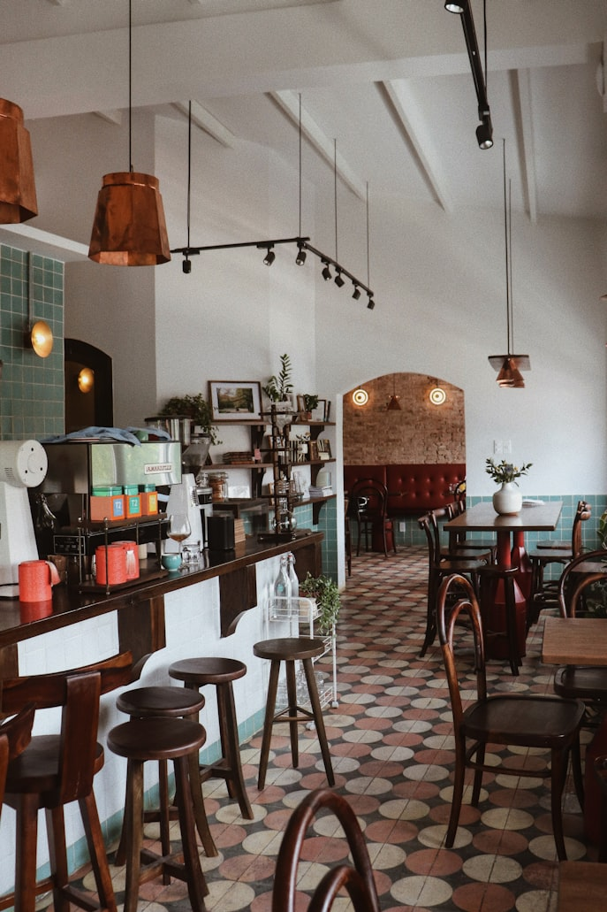

<div align="center">
  <br />
    
  <br />
  <div>
    
    
    
    
    
  </div>
  <h3 align="center">ElBasta - Salon de Thé & Café Moderne</h3>
  <div align="center">
    Commande en ligne, suivi en temps réel, et expérience premium pour les amateurs de thé et de douceurs à Alger.
  </div>
</div>

## 📋 Table of Contents

1. 🍵 [Introduction](#introduction)
2. ⚙️ [Tech Stack](#tech-stack)
3. ✨ [Features](#features)
4. 🤸 [Quick Start](#quick-start)
5. 🔗 [Assets & Links](#assets)
6. 🚀 [More](#more)

## 🍵 Introduction

**ElBasta** est un salon de thé moderne situé à Alger, spécialisé dans les boissons artisanales, crêpes françaises, et douceurs faites maison. Ce projet Next.js propose une expérience de commande en ligne fluide, un suivi de commande en temps réel, et une interface administrateur complète. Il est optimisé pour le SEO, la performance, et l’accessibilité.

## ⚙️ Tech Stack

- **[Next.js](https://nextjs.org/)** (App Router, SSG/SSR/ISR, SEO)
- **[Supabase](https://supabase.com/)** (PostgreSQL, Auth, Realtime)
- **[Tailwind CSS](https://tailwindcss.com/)** (UI rapide et responsive)
- **[shadcn/ui](https://ui.shadcn.com/)** (Composants modernes et accessibles)
- **[TypeScript](https://www.typescriptlang.org/)** (Typage strict)
- **[Zustand](https://zustand-demo.pmnd.rs/)** (Gestion d’état du panier)
- **[Lucide React](https://lucide.dev/)** (Icônes modernes)
- **[Cloudinary](https://cloudinary.com/)** (Stockage images produits)
- **[Firebase/Firestore](https://firebase.google.com/)** (Gestion dynamique produits/commandes)
- **[Vercel](https://vercel.com/)** (Déploiement, Analytics, CDN)

## ✨ Features

- **Commande en ligne** : Panier interactif, calcul automatique, WhatsApp direct.
- **Suivi en temps réel** : Page `/suivi` pour suivre l’état de la commande.
- **Interface admin** : Dashboard, gestion statuts, analytics, CRUD produits.
- **SEO avancé** : Métadonnées dynamiques, Open Graph, Twitter Cards, sitemap, robots.txt, JSON-LD, canonical URLs.
- **Performance** : SSG/ISR, images optimisées, Lighthouse 95+, lazy loading, CDN Vercel.
- **Accessibilité** : Composants ARIA, navigation clavier, contrastes, alt images, heading hierarchy.
- **Design responsive** : Mobile-first, breakpoints optimisés, expérience fluide sur tous supports.
- **Intégrations** : Supabase, WhatsApp, Google Maps, Cloudinary, réseaux sociaux.
- **Sécurité** : Auth admin, validation côté client, bonnes pratiques Next.js.
- **Extensible** : Architecture modulaire, hooks personnalisés, composants réutilisables.

## 🤸 Quick Start

**Prerequisites**
- [Git](https://git-scm.com/)
- [Node.js](https://nodejs.org/en)
- [npm](https://www.npmjs.com/) ou [pnpm](https://pnpm.io/)

**Cloning the Repository**
```bash
git clone https://github.com/username/el-basta.git
cd el-basta
```

**Installation**
```bash
npm install
# ou
pnpm install
```

**Set Up Environment Variables**
Créez un fichier `.env.local` à la racine :
```env
NEXT_PUBLIC_SUPABASE_URL=your_supabase_url
NEXT_PUBLIC_SUPABASE_ANON_KEY=your_supabase_anon_key
NEXT_PUBLIC_FIREBASE_API_KEY=xxx
NEXT_PUBLIC_FIREBASE_AUTH_DOMAIN=xxx
NEXT_PUBLIC_FIREBASE_PROJECT_ID=xxx
NEXT_PUBLIC_FIREBASE_STORAGE_BUCKET=xxx
NEXT_PUBLIC_FIREBASE_MESSAGING_SENDER_ID=xxx
NEXT_PUBLIC_FIREBASE_APP_ID=xxx
NEXT_PUBLIC_CLOUDINARY_CLOUD_NAME=xxx
NEXT_PUBLIC_CLOUDINARY_UPLOAD_PRESET=xxx
NEXT_PUBLIC_ADMIN_HASHED_PASSWORD_BASE64=xxx
```

**Running the Project**
```bash
npm run dev
```
Ouvrez [http://localhost:3000](http://localhost:3000) dans votre navigateur.

## 🔗 Assets & Links

- [Site officiel ElBasta](https://elbasta.store)
- [Facebook](https://www.facebook.com/profile.php?id=61552378694624)
- [Instagram](https://www.instagram.com/elbasta.store/)
- [Google Maps](https://www.google.com/maps/place/ELBASTA/@36.7338212,3.1742928,17z)
- [Supabase](https://supabase.com/)
- [Cloudinary](https://cloudinary.com/)
- [Vercel](https://vercel.com/)

## 🚀 More

- **Documentation technique** : [Wiki du projet](https://github.com/username/el-basta/wiki)
- **Support** : dev@elbasta.store
- **Issues** : [Créer un ticket](https://github.com/username/el-basta/issues)
- **Licence** : MIT

---

<div align="center">
  <b>ElBasta</b> - Savourez des Moments Doux ☕🥐✨
</div> 